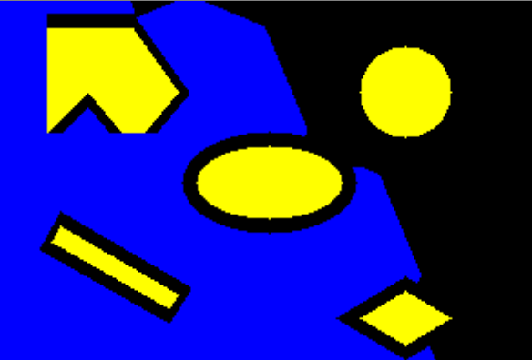

README File

Youtube : https://www.youtube.com/watch?v=m8FAkKLAhUQ&feature=emb_logo

 
 
 
.png)
_________________________________________________________________________________________

Project 2 - ENPM 661 - Planning for Autonomous Robotics
_________________________________________________________________________________________
Authors: 

Govind Ajith Kumar

Masters Robotics 
University of Maryland
College Park
Maryland
20740 USA

UID : 116699488

Rajeshwar NS

Masters Robotics
University of Maryland
College Park
Maryland
20740 USA

UID : 116921237
_________________________________________________________________________________________
Language: Python 3.7.x
_________________________________________________________________________________________
Libraries implemented and required to be installed for the code to execute:

numpy :: for matrices and other associated numerical calculations. 
math :: for all mathematical operations
heapq :: for priority queue
time :: for measuring the time
cv2 :: for image related operations (OpenCV 4.xx)
pygame :: For animations
_________________________________________________________________________________________

This README file is for two codes
The programme solves the obstacle map based on the Dijkstras Algorithm. 

Code 1 : Solves the obstacle map based on the Dijkstras Algorithm For Point Robot

The following inputs are required by the user:

x_start= the x coordinate of the start
y_start= y coordinate of the start
x_goal= x coordinate of the goal
y_goal= y coordinate of the goal

Code 2 : Solves the obstacle map based on the Dijkstras Algorithm For Rigid Robot

The following inputs are required by the user:

x_start= the x coordinate of the start
y_start= y coordinate of the start
x_goal= x coordinate of the goal
y_goal= y coordinate of the goal
Radius = Radius of the robot
Clearence = Clearance of the robot

---------------------------------------------------------------------------------------------

Both codes takes about 5 minutes to solve (subject to the leptop specifications), and then output 
the following:

>After Reaching the goal, the backtracking will commence.

> Once the backtracking is complete the following sets of outputs are given out.

> Image of the obstacles

> Pygame animation of the robot visiting all the nodes. (Note: The animation is tuned for full screen. 
Hence, it will open
a new screen altogether. PLEASE DO NOT CLOSE IT IN BETWEEN, as that will cause the kernel to die, if 
run in Jupyter Notebook and will require the whole code to be run again. The animation will stop itself, 
when the goal is reached.)

> The path backtracked by the code.

---------------------------------------------------------------------------------------------

