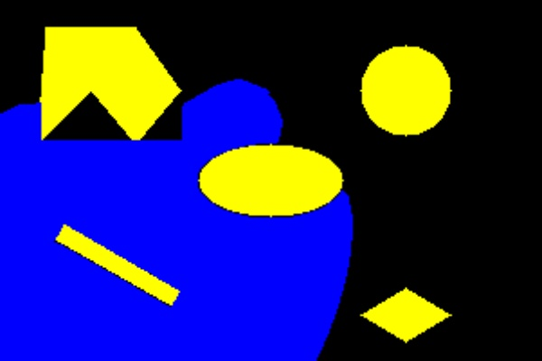

README File
_________________________________________________________________________________________

				Project 3 | Phase 2 | ENPM 661 | Planning for Autonomous Robots |

						SUBMISSION : March 20, 2020

GITHUB: https://github.com/govindak-umd/ENPM661/tree/master/Project%203/Project%203%20Phase%202 

YOUTUBE: https://www.youtube.com/watch?v=VBzvzb2vaYg&feature=emb_log 
 
YOUTUBE: https://www.youtube.com/watch?v=_RSq41MF34w 
 
		##NOTE : Also attached a new folder, with an alternative method, where we found a much faster solution.### 
TIME TAKEN : < 1 minute  
You can find the alternative path video in attached submission as well as here... 
YOUTUBE: https://youtu.be/YeQo8LIU1ZE 
 

 
 
 
 
 
 
 
 
 
 

 A* Algorithm for Rigid Robot with Obstacles | Govind Ajith Kumar & Rajeshwar NS
_________________________________________________________________________________________
Authors: 

Govind Ajith Kumar
UID : 116699488

Masters Robotics 
University of Maryland
College Park
Maryland
20740 USA
--------------------------
Rajeshwar NS
UID : 116921237

Masters Robotics
University of Maryland
College Park
Maryland
20740 USA
_________________________________________________________________________________________
Language: Python 3.7.x
_________________________________________________________________________________________
Libraries implemented and required to be installed for the code to execute:

numpy :: for matrices and other associated numerical calculations. 
math :: for all mathematical operations
heapq :: for priority queue
time :: for measuring the time
cv2 :: for image related operations (OpenCV 4.xx)
pygame :: For animations
matplotlib:: To plot the graphs and see the path taken by the robot from the start to the goal node
_________________________________________________________________________________________

This README file is for two codes
The programme solves the obstacle map based on the Dijkstras Algorithm. 

Code : Solves the obstacle map based on the A* Algorithm For Rigid Robot with a radius and clearance

The following inputs are required by the user:

x_start= the x coordinate of the start
y_start= y coordinate of the start
orientation = starting orientation of the Robot
x_goal= x coordinate of the goal
y_goal= y coordinate of the goal
Radius = Radius of the robot
Clearence = Clearance of the robot

---------------------------------------------------------------------------------------------
Time for solution for the following inputs:
##############################################################################################
Enter the x coordinate of the start:  50

Enter the y coordinate of the start:  30

Enter the Orientation at start (enter in multiples of 30 degreees and less that 360 degrees), :  60

Enter the x coordinate of the goal:  150

Enter the y coordinate of the goal:  150

Enter the radius of the robot:  1

Enter the clearance of the robot: 1
##############################################################################################

was around 2050 seconds (~33 minutes).

Both codes takes a few minutes to solve (subject to the system specifications), and then output 
the following:

##After Reaching the goal, the backtracking will commence.

## Once the backtracking is complete the following sets of outputs are given out:

> Image of the obstacles (OpenCV)

> Animation showing the visited nodes and the backtracked path (using pygame)

> Graph plot showing path of solution (MatplotLib)

> Image of the visited nodes (OpenCV)

> Image of backtracked path (OpenCV)

> Graph plot showing children direction for each parent (MatplotLib)

> Zoomed in version of the quivers generated (MatplotLib)

---------------------------------------------------------------------------------------------

