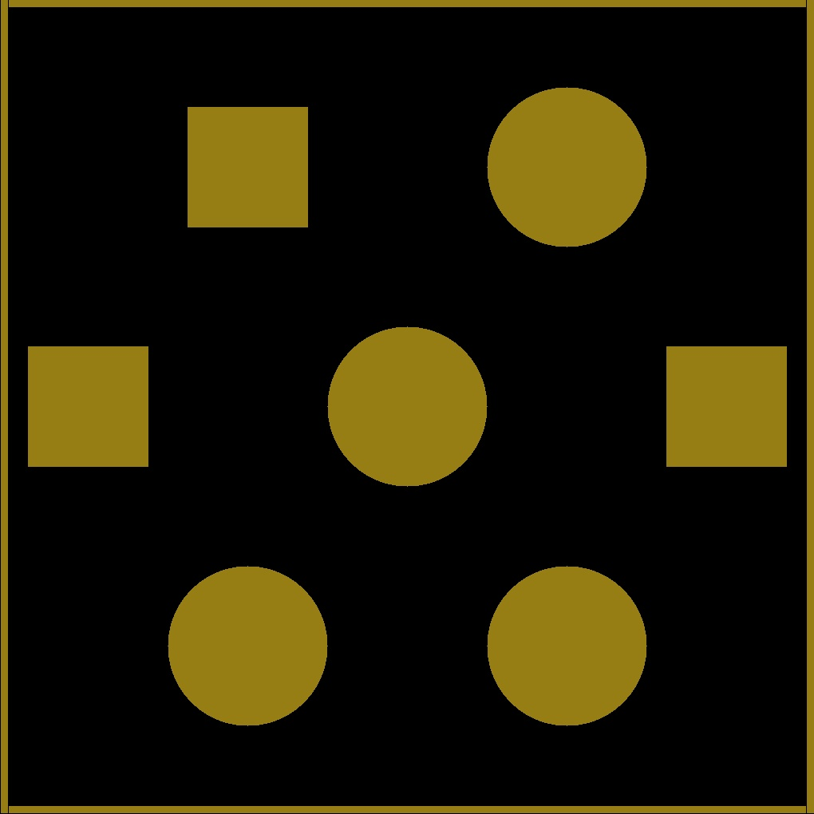
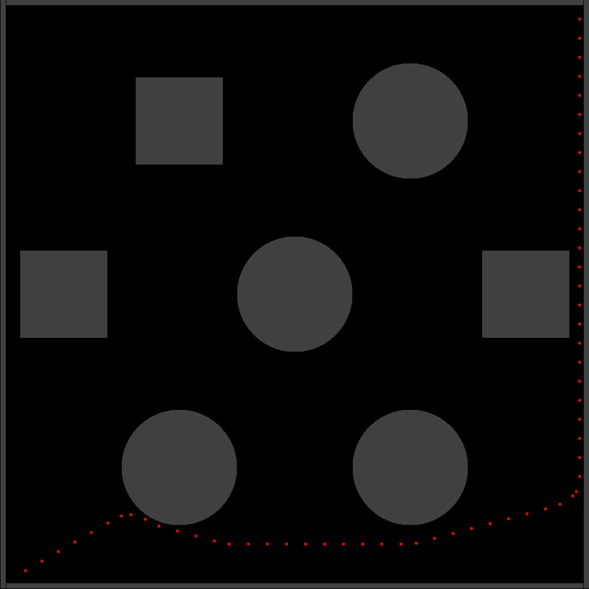
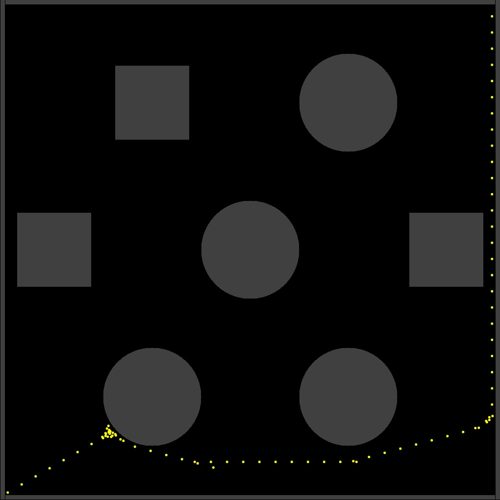
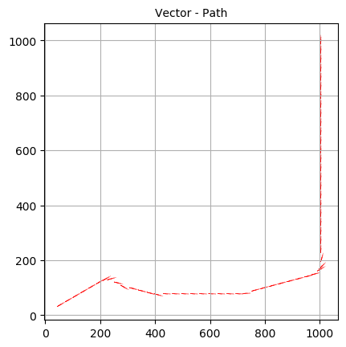

README File
_________________________________________________________________________________________

				Project 3 | Phase 3 | ENPM 661 | Planning for Autonomous Robots |
						A* Programme for Non-Holonomic robot

						SUBMISSION : April 10, 2020

--------------------------------------------------%%------------------------------------------- 
GITHUB:  https://github.com/govindak-umd/ENPM661/tree/master/Project%203/Project%203%20Phase%203  
YOUTUBE: 
--------------------------------------------------%%------------------------------------------- 
 
 
 
 
 
 
 
 
 
 
 
 
 
 
_________________________________________________________________________________________
Authors: 

Govind Ajith Kumar
UID : 116699488

Masters Robotics 
University of Maryland
College Park
Maryland
20740 USA
--------------------------
Rajeshwar NS
UID : 116921237

Masters Robotics
University of Maryland
College Park
Maryland
20740 USA
_________________________________________________________________________________________
Language: Python 3.7.x

THIS PROGRAMME TAKES THE USER INPUTS BELOW AND SOLVES THE OBSTACLE SPACE VERY QUICKLY
time taken (for A* solving) ~ <1 second
To solve the necessary test cases, please know that the start and the goal points here are adjusted based on the clearance and the width of the robot
This avoids the goal or the start getting into the borders or any obstacles
For the turtle bot, this value is fixed at 35
If you wish to change this value, please rerun the code after doing so.
ALSO !! NOTE !!, the coordinates of the obstacle points have been multiplied by a factor of 100

This ensures a clearer graph. Hence, please multiply by a factor of 100, before input. For example: 5.5 will be = 5.5*100 = 550
Range of x coordinates you can enter  =  0 - 1020
Range of y coordinates you can enter  =  0 - 1020
--------------
Please wait while the map is being generated. Approximate wait time < 5 seconds . 
-------------
Please wait while your solution is being calculated . 
Time taken on a high end Personal Computer ~ < 1 second
--------------
This will generate a map with solution, backtracked path, quiver plot and an animation too! 
NOTE: Quiver plot will take an additional 10 minutes to calculate 

_________________________________________________________________________________________
Libraries implemented and required to be installed for the code to execute:

numpy :: for matrices and other associated numerical calculations
copy :: to copy
math :: for all mathematical operations
heapq :: for priority queue
time :: for measuring the time
cv2 :: for image related operations (OpenCV 4.xx)
pygame :: For animations
matplotlib:: To plot the graphs and see the path taken by the robot from the start to the goal node and the quiver plots

			NOTE :::: PLEASE MAKE SURE THAT THE MATPLOTLIB GRAPHS CAN BE DISPLAYED, ESPECIALLY IF BEING RUN ON SPYDER or even any other IDE
_________________________________________________________________________________________

Code : Solves the obstacle map based on the A* Algorithm For Rigid Robot with a radius and clearance fro non- Holonomic Drive Robot

The following inputs are required by the user:

-> Vector with x and y coordinate of the start and the initial orientation
-> Vector with x and y coordinate of the goal
-> LEFT WHEEL RPM AND RIGHT WHEEL RPM
-> Step Count
-> time you wish to choose to run the robot
Enter the  here, with a blank in between them (suggested : 10 10 30) : > 10 10 30
Enter the x and y coordinate of the goal and the , in the form of blanks (suggested : 1010 1010) : > 1010 1010
Enter the LEFT WHEEL RPM AND RIGHT WHEEL RPM  : > 3 8
Enter the clearance of the robot with the nearby obstacles : (suggested value  < 5) : > 5
Enter the step (1-10): (suggested values  = 1) : > 1
Please enter the time you wish to choose to run the robot (suggested value = 1 second) : 1

---------------------------------------------------------------------------------------------
Time for solution for the following inputs: 
approx 5 seconds for map generation
1 second for solution
2 seconds for visited and backtracked maps
<10 seconds for quiver plot
##############################################################################################

Enter the x and y coordinate of the start and the initial orientation here, with a blank in between them (suggested : 10 10 30) : > 10 10 30
Enter the x and y coordinate of the goal and the , in the form of blanks (suggested : 1010 1010) : > 1010 1010
Enter the LEFT WHEEL RPM AND RIGHT WHEEL RPM  : > 3 8
Enter the clearance of the robot with the nearby obstacles : (suggested value  < 5) : > 5
Enter the step (1-10): (suggested values  = 1) : > 1
Wheel radius is calculated to be 76mm/2 -> approximating to 0.5
Please enter the time you wish to choose to run the robot (siggested value = 1 second) : 1
##############################################################################################

Both codes takes a few minutes to solve (subject to the system specifications), and then output 
the following:

##After Reaching the goal, the backtracking will commence.

## Once the backtracking is complete the following sets of outputs are given out:

> Image of the obstacles (OpenCV)

> Animation showing the visited nodes and the backtracked path (using pygame)

> Graph plot showing path of solution (MatplotLib)

> Image of the visited nodes (OpenCV)

> Image of backtracked path (OpenCV)

> Graph plot showing quiver plot(MatplotLib)

---------------------------------------------------------------------------------------------

