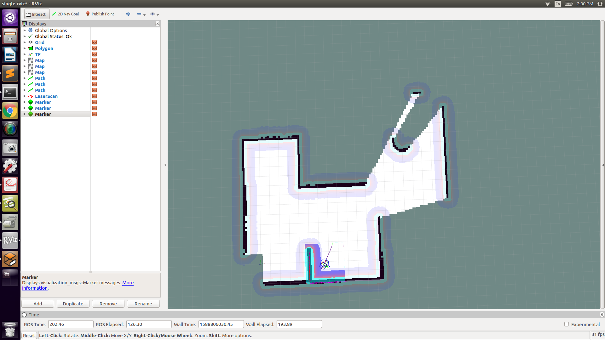

To run the workspace
----

                Clone proj_5
                cd ..
                catkin_make
                source ./devel/setup.bash
                (open new tab)
                roscore
                (open new tab)
                roslaunch rrt_package rrtsimulationkobuki.launch 
                (open new tab)
                roslaunch rrt_exploration single.launch 

Links to Youtube Video for Path Planning
---
        https://youtu.be/q5-7wXwrHNc
        https://youtu.be/8_35XjTT8T8
        https://youtu.be/3Nl3yUiuWp8
----

        Original Map for Path Planning
 
 

    RRT Solution
 
 

    RRT* Solution
 
 

    RViz 
 
 
 
 
 
 
 
 
 
 
 
 
 
 

    Gazebo
 
 
 
 
