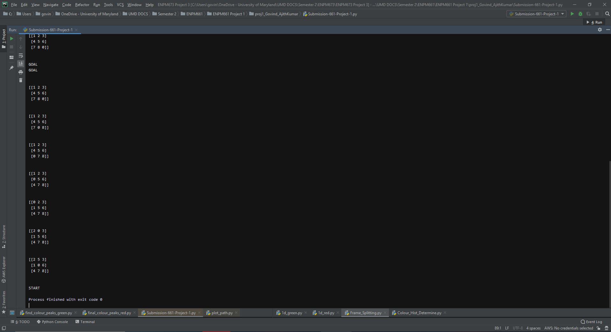
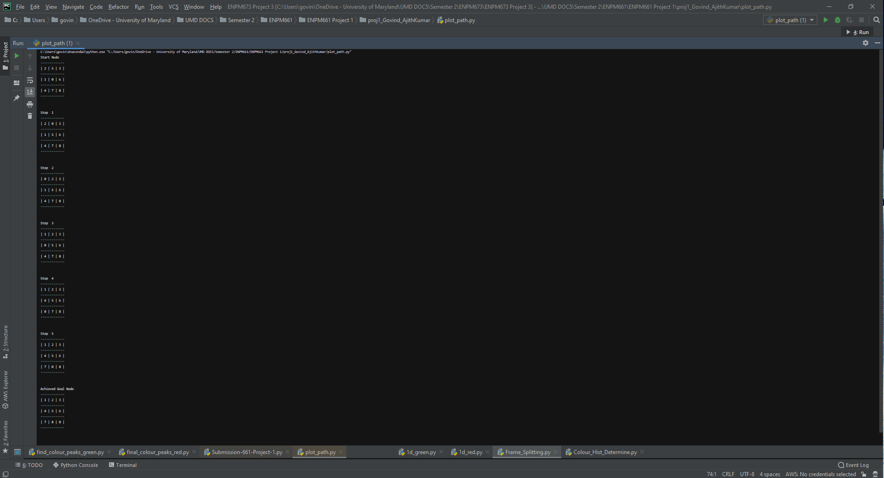

README File
_________________________________________________________________________________________

Project 1 - ENPM 661 - Planning for Autonomous Robotics

By: 

Govind Ajith Kumar
University of Maryland
Masters Robotics
govindak@umd.edu

UID : 116699488
-------------------------------------------------------------------------------------------
Libraries used :

Numpy :: for matrices and other associated numerical calculations. 
Copy :: To work with copy function, to create duplicates
ast :: Used for converting strings of lists, to pure lists

------------------------------SOLVED SCREENSHOTS ------------------------------------------
 
 
 
 
 
 
 
 
-------------------------------------------------------------------------------------------
TEST CASES - 
#test cases as per rubric
# s = [4,1,0,6,3,2,7,5,8]  - >  Solvable case
# s = [2,5,3,1,0,6,4,7,8]  - >  Solvable case
# s = [8,6,7,2,5,4,3,0,1]  - >  Solvable case
# s = [6,4,7,8,5,0,3,2,1]  - >  Solvable case
# s = [1,4,0,6,3,2,7,5,8]  - >  Unsolvable case
# s = [8,7,6,2,5,4,3,0,1]  - >  Unsolvable case
g = [1,2,3,4,5,6,7,8,0]    - >goal position
---------------------------------------------------------------------------------------------

The code takes in a starting position (s) and a goal position (g).

The starting position or the starting matrix is declared with the variable 's' before the
generate_path function.

The goal position or the ending matrix is declared with the variable 'g' before the
generate_path function as well.

Before runnning the programme as a whole, do declare the above two variables.

It is to be noted that the matrix is entered (for both 's' and 'g') in the form of a list.

-------------------------------------------------------------------------------------------
For example :

To enter the following matrix,

1 | 2 | 3

4 | 5 | 6

7 | 8 | 0  

the user must enter 

s = [1,2,3,4,5,6,7,8,0]

-------------------------------------------------------------------------------------------

The function generate_path will return the solution and notify the user when the Goal is reached!

-------------------------------------------------------------------------------------------

The programme can also successfully backtrack, and show the path traversed by the Blank Tile from 
the start to the finish and backwards

